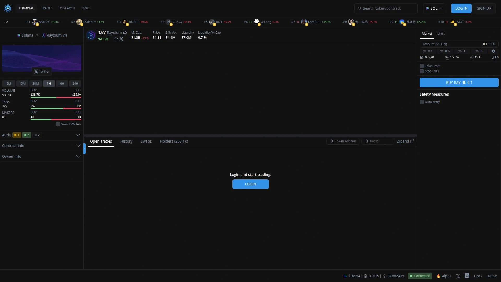
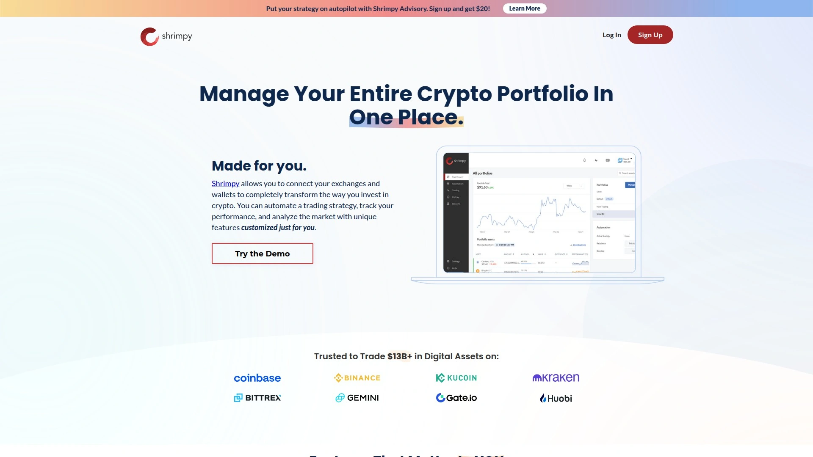

# 2025年最值得推荐的15款加密货币自动交易机器人

加密货币市场7×24小时不停歇运转,人肉盯盘早就不是什么明智选择了。自动化交易机器人能在你睡觉时继续工作,按照预设策略执行买卖,把情绪化决策彻底排除在外。从AI驱动的智能算法到简单易用的网格交易,这些工具正在重新定义加密货币交易的效率上限。无论你是刚入门的新手还是需要高级定制的专业交易员,市场上总有一款机器人适合你的风格和预算。

## **[Cryptohopper](https://cryptohopper.com)**

云端运行的全能型AI交易平台,新手和专业玩家都能找到适合自己的工具。

这个平台最大的卖点是它的**AI算法训练功能**——你可以喂给机器人各种策略,让它自己学习并适应市场变化。 自动回测功能能同时测试多个策略,直接把表现最好的导入实盘。

支持17个主流交易所,包括Binance、Coinbase等。 社交交易市场让你能订阅信号服务,或者直接购买其他交易员预配置好的策略模板。 跟踪止损、美元成本平均法(DCA)、套利工具一应俱全。

免费计划提供20个持仓位和基础功能,付费版最高每月107.5美元。 对于需要**高度自动化和AI辅助决策**的交易者来说,这是目前市场上功能最完整的选择之一。 平台还提供策略设计器,即使不懂编程也能创建复杂交易算法。

***

## **[3Commas](https://3commas.io)**

老牌交易自动化工具,专业交易员首选的多功能平台。

3Commas以其**用户友好界面和多样化机器人类型**闻名行业。 平台提供智能交易终端,可以从单一界面管理18个交易所的账户。

网格机器人、DCA机器人、期货机器人等多种策略可选。 智能订单功能包括止盈止损、追踪卖出等风险管理工具。 回测系统让你能用历史数据验证策略有效性,避免拍脑袋决策。

月费从4美元到59美元不等,性价比相当高。 特别适合已经有一定交易经验、想要进阶使用自动化工具的中级玩家。 Coinbase官方文章都专门介绍过3Commas的自动化优势。

***

## **[Pionex](https://www.pionex.us)**

内置16个免费交易机器人的交易所,零订阅费用。

Pionex最大的特色是**机器人完全免费**,你只需要支付0.05%的交易手续费。 不像其他平台还要额外收月费,这里的网格交易机器人、无限网格、现货期货套利机器人全部开箱即用。

网格机器人在震荡行情中表现稳定,Reddit用户评价"一年下来即使在过山车行情里也能保持35%收益"。 支持250多种加密货币,包括比特币、以太坊、狗狗币等主流币种。

平台获得美国FinCEN的MSB牌照,Bloomberg和Bitcoin.com都报道过它的快速增长。 2021年月交易量达到50亿美元。 特别适合预算有限但想尝试自动化交易的入门用户。

***

## **[Bitsgap](https://bitsgap.com)**

统一16个交易所账户的一体化平台,专业工具拉满。

Bitsgap把你在不同交易所的账户整合到一个界面里管理。 **GRID机器人、DCA机器人、BTD(逢低买入)机器人、COMBO机器人**还有DCA期货机器人,策略选择非常丰富。

智能交易功能包括阶梯订单、止盈止损、追踪订单等高级工具。 实时投资组合追踪让你随时掌握收益情况。 免费试用7天专业版,之后根据需要选择付费计划。

平台的网格交易策略是这样工作的:在设定价格区间内自动挂买卖单,价格波动时高抛低吸赚差价。 BTD机器人专门捕捉市场下跌时的买入机会,在跌势中被认为非常有效。 支持Binance、Kraken、Bitfinex、Coinbase等主流交易所。

***

## **[TradeSanta](https://tradesanta.com)**

云端运行的交易机器人,2018年上线至今口碑稳定。

TradeSanta的设置流程**快速简单**,几分钟就能启动第一个机器人。 提供网格交易、DCA、期货交易三大类机器人,每种都针对不同市场环境优化。

网格机器人适合横盘震荡,DCA机器人用于长期定投降低波动风险,期货机器人支持做多做空双向操作。 智能订单系统包括止损、止盈、追踪功能,风险控制到位。

**信号市场**是个亮点——你可以订阅专业分析师的交易信号,机器人收到信号后自动执行交易。 还有复制交易功能,直接镜像成功交易者的策略。

支持Binance、OKX、Kraken、Bybit、Coinbase Pro等主流交易所。 提供回测和模拟交易,可以在不动真金白银的情况下验证策略。 移动端App让你随时随地管理机器人。

---

## **[Coinrule](https://coinrule.com)**

无需编码的规则引擎,用"如果-那么"逻辑创建交易策略。

Coinrule最适合**不懂编程但想自定义策略**的交易者。 界面采用简单的条件逻辑:比如"如果比特币下跌5%,那么买入500美元BTC"。

平台提供75个以上的预制策略模板,包括"逢低买入""突破交易""追踪止损"等常见玩法。 每个策略都能用历史数据回测,还有模拟交易模式练手。

支持250多条可定制规则,可以组合多个条件触发交易——比如"价格+RSI指标同时满足条件时才执行"。 设置每个策略的最大交易限额,防止单次失误造成大额损失。

月费从免费到449.99美元不等,根据交易量和功能需求选择。 支持10个主流交易所。 特别适合想要灵活控制策略但又不想学编程的用户。

***

## **[HaasOnline](https://www.haasonline.com)**

面向程序员的高级平台,提供强大的HaasScript脚本语言。

HaasOnline用自己开发的**HaasScript语言**让你能编写复杂的交易算法。 这是给真正想要深度定制、愿意写代码的专业交易员准备的工具。

支持23个交易所,覆盖面是业内最广的之一。 除了标准的机器人类型,还提供加密货币指数机器人,可以自动维护一篮子代币的投资组合。

月费从9美元到99美元,提供私有服务器部署选项,数据和策略完全掌握在自己手里。 这种设置对于管理大额资金或者有特殊隐私需求的机构投资者特别有吸引力。

学习曲线陡峭,但自由度也是最高的。 如果你有编程背景,想要实现市面上现成机器人做不到的策略,HaasOnline值得研究。

***

## **[Mizar](https://mizar.com)**

基于绩效收费的AI交易平台,只有盈利时才付钱。

Mizar的收费模式很特别:**只在你赚钱时收取一定比例费用**,没有固定月租。 这种设计把平台利益和用户利益绑在一起。

**社交交易市场**是核心功能——你可以关注并复制表现优秀的交易员策略,系统自动执行他们的操作。 平台根据历史表现给交易员排名,透明度很高。

支持11个交易所,提供追踪止损、多层止损订单等风险管理工具。 回测和模拟交易功能让你在投入真金白银前先验证策略。

绩效费用按交易量计算,从0.0047%到0.1%不等。 还有个小福利:持有平台的MZR代币可以减免部分费用。 特别适合想要**低启动成本、跟随专家策略**的新手交易者。

***

## **[Altrady](https://www.altrady.com)**

全方位的交易平台,把投资组合管理和自动化工具融为一体。

Altrady不只是个机器人平台,更像是**加密货币交易的指挥中心**。 从一个界面管理多个交易所账户,买卖操作、市场监控、新闻聚合、交易日志全在一处搞定。

信号机器人、网格机器人是基础配置,高级功能包括阶梯挂单、追踪止损、OCO订单(一单成交另一单取消)。 快速扫描功能会通知你市场的急涨急跌,抓住短线机会。

对新手友好,提供大量学习资源教你如何低风险交易。 对老手来说,技术分析工具结合实时数据能帮你做出更精准的决策。

免费计划包含2个信号或网格机器人、无限DCA机器人、50个价格提醒。 付费版最高89美元/月。 支持16个现货交易所和3个期货交易所。

---

## **[Quadency (Quad Terminal)](https://quadterminal.com)**

AI助手Cody加持的智能平台,用自然语言就能下达交易指令。

Quadency最酷的功能是**AI助手Cody**——你可以用普通英语聊天的方式告诉它交易策略,它会自动转化成可执行的指令。 "如果以太坊涨到3000美元就卖出10%"这样的命令,Cody都能理解。

平台整合多个交易所账户,提供360度投资组合视图。 智能订单路由器QUADX会自动找到流动性最好、执行价格最优的交易所下单。

预制机器人从简单的定投机器人到高频策略都有,满足各种技能水平的用户。 回测工具用历史数据验证策略,不用冒险就能看到潜在表现。

平均成本分析功能帮你准确计算盈亏,投资组合分析增强版让你了解真实持仓成本。 QUAD代币是平台原生代币,持有可以享受更低交易费用和高级功能访问权限。

***

## **[Shrimpy](https://www.shrimpy.io)**

专注投资组合再平衡的自动化工具,维持理想资产配置。

Shrimpy的核心功能是**自动再平衡**,通俗说就是定期调整你的持仓比例回到目标状态。 比如你设定比特币占50%、以太坊30%、其他币20%,当市场波动打破这个比例,Shrimpy会自动买卖把配置调回来。

再平衡可以基于时间触发(每小时/每天/每周),也可以基于偏差触发(当某个币种比例偏离设定值超过一定百分比时执行)。 后者更高效,因为只在真正需要时才交易。

界面简单直观,在投资组合标签页设置你喜欢的币种和占比,系统会自动计算需要执行的交易。 支持止损自动化,帮你管理风险。

研究显示,定期再平衡能在震荡市中提升收益,因为你自然地在低位买入、高位卖出。 特别适合长期持有多种加密货币、想要维持固定配置的投资者。

***

## **[TokenSets](https://www.tokensets.com)**

去中心化的DeFi投资组合管理,基于以太坊智能合约运行。

TokenSets建立在Set Protocol之上,让你能购买和管理**自动执行策略的代币篮子**(称为Sets)。 每个Set代表一组底层资产,智能合约会按照预设规则自动调仓。

最有名的是**DeFi Pulse Index**,它简化了加密货币多元化投资——买一个代币就等于持有一篮子DeFi项目。 策略从简单的资产比例再平衡,到复杂的趋势跟踪(基于移动平均线等技术指标)都有。

与AAVE、Compound等DeFi协议集成,自动执行收益耕作策略。 这解决了手动参与DeFi挖矿时高Gas费和复杂操作的痛点。

使用很简单:浏览现有Sets,查看策略、历史表现和底层资产,用ETH或其他支持的资产直接购买Set代币。 投资后可以监控表现,随时调整或探索新策略。 支持3条区块链。

***

## **[Hummingbot](https://hummingbot.io)**

开源的专业级机器人,面向流动性提供者和做市商。

Hummingbot是**完全开源且免费**的交易机器人软件,主要服务于专业的流动性提供者和做市商。 支持19个去中心化交易所和24个中心化交易所,覆盖面极广。

做市策略、套利策略、跨交易所对冲等高级功能都有。 因为是开源的,你可以完全自定义代码,实现任何想要的策略。

门槛比较高,需要一定的技术背景和对做市机制的理解。 但正因如此,对于有能力的用户来说,这是**最灵活、最强大**的选择。 没有订阅费用,所有功能免费使用。

特别适合想要在多个交易所提供流动性赚取手续费的专业玩家,或者机构级别的交易团队。

***

## **[CryptoHero](https://cryptohero.com)**

带模拟交易功能的机器人平台,练手零风险。

CryptoHero的**模拟交易模式**是最大亮点——新手可以在不投入真钱的情况下测试各种策略,看看机器人到底怎么工作的。

支持10个交易所,提供常见的网格交易、DCA等策略机器人。 免费版就能使用核心功能,付费版最高29.99美元/月,价格相当亲民。

界面设计对初学者友好,没有太多复杂的术语和设置。 特别适合刚接触自动化交易、想要先试水再投入的新手玩家。

***

## **[Cornix](https://cornix.io)**

面向新手和专家的全能自动化平台,14天免费试用。

Cornix提供**数千种预配置策略**,适合不同经验水平的交易者。 用户界面设计简洁,即使是交易小白也能快速上手。

机器人7×24小时运行,不需要你一直盯着市场。 支持主流交易所,自动执行买卖信号。

14天免费试用不需要绑定信用卡,可以充分体验所有功能再决定是否付费。 平台提供全天候客服支持,遇到问题能及时得到帮助。

定价灵活,从入门级到专业级有多个档次可选。 适合想要**省时省力、同时保持策略多样性**的各类交易者。

***

## 常见问题

**交易机器人真的能赚钱吗?**

机器人只是工具,不是印钞机。它们的价值在于**消除情绪化决策、24小时执行策略、严格遵守风险规则**。 网格机器人在震荡市中表现好,DCA机器人适合长期定投,不同策略对应不同市场环境。 但市场急剧变化时,预设规则可能失效,所以需要定期监控和调整,不能完全"设置后忘记"。

**新手应该选择哪个平台?**

Pionex最适合预算有限的新手,因为机器人完全免费。 Coinrule和CryptoHero的界面对初学者友好,提供大量教程和模板。 如果想跟着专家学,Mizar的社交交易功能让你能直接复制高手策略。 建议先用模拟交易练手,Bitsgap和TradeSanta都提供免费试用或演示账户。

**如何选择合适的交易策略?**

网格交易适合价格在一定区间震荡的币种,通过高抛低吸赚差价。 DCA(美元成本平均)适合长期看好某个币、想分批建仓降低风险的场景。 套利机器人捕捉不同交易所的价格差,但机会窗口很短,需要快速执行。 趋势跟踪策略在单边行情中表现好,但震荡市容易频繁止损。 建议先回测历史数据,看看不同策略在过去表现如何,再小资金实盘验证。

***

## 总结

加密货币自动交易已经从极客专属工具变成了普通投资者都能用上的基础设施。从完全免费的Pionex到AI驱动的Cryptohopper,市场上的选择丰富到能满足各种需求和预算。对于想要认真做自动化交易的人来说,[Cryptohopper](https://cryptohopper.com)凭借其**强大的AI学习能力、丰富的策略市场和完整的工具链**,是目前综合实力最强的平台——无论你是需要简单的网格交易,还是想训练专属的AI交易算法,这里都能找到解决方案。记住,再好的机器人也需要合理的策略和定期的监控,自动化是提升效率的手段,但不能替代你对市场的理解。
